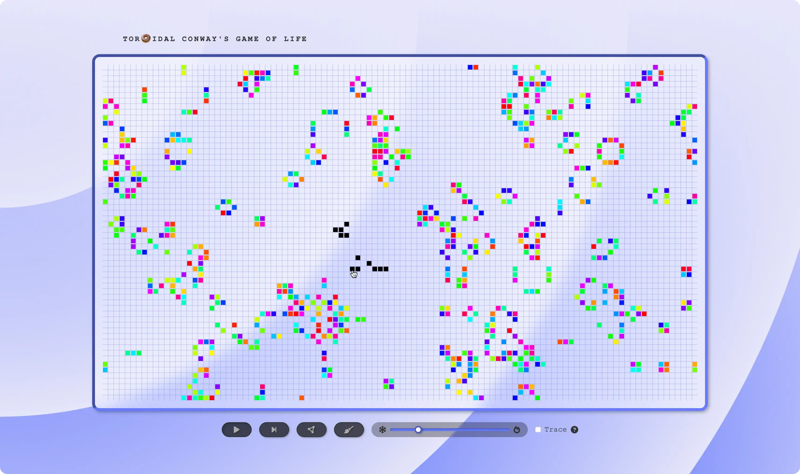

# Conway's Game of Life

It's **interactive:** you can place or remove live cells anywhere on the canvas. [Try it out](https://korikhin.github.io/gol/)



## Patterns

To start, you can draw classic patterns such as the Glider or the Acorn, or randomly populate the grid with cells.

```
 ░░ ░░ ░░ ░░ ░░    ░░ ░░ ░░ ░░ ░░ ░░ ░░ ░░ ░░
 ░░ ██ ██ ░░ ░░    ░░ ░░ ██ ░░ ░░ ░░ ░░ ░░ ░░
 ░░ ░░ ██ ██ ░░    ░░ ░░ ░░ ░░ ██ ░░ ░░ ░░ ░░
 ░░ ██ ░░ ░░ ░░    ░░ ██ ██ ░░ ░░ ██ ██ ██ ░░
 ░░ ░░ ░░ ░░ ░░    ░░ ░░ ░░ ░░ ░░ ░░ ░░ ░░ ░░
```
